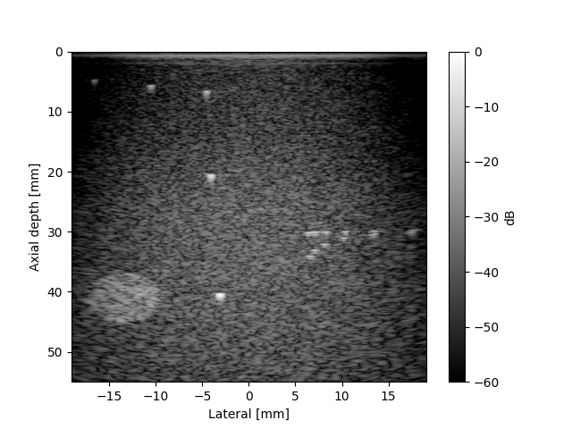
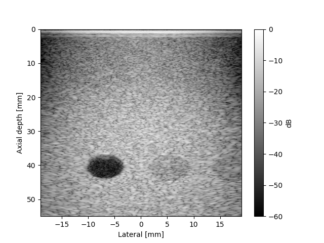

# Ultrasound Beamformer using CUDA

A ***raw RF ultrasound data beamformer*** that produces a B-mode image from a pre-existing ultrasound RF dataset provided by UltraSound ToolBox [(USTB)](https://unioslo.github.io/USTB/). ***Uses optimized CUDA C++***. Tested and verified on `NVIDIA A100` and `NVIDIA T4` GPUs.

## OK, but what exactly is beamforming?
***Beamforming*** is essentially a signal processing technique that combines time delayed signals from an array of sensors (sensors usually being antenna or piezoelectric elements) to focus signals onto or from a certain region. Think of it as a way to make sense of and cleanly understand signals recieved at each element. If we want the signal to be focused at a certain region, then we need to increase the signal strength in the direction of that region and attenuate the signal for other directions. This involves weighting element activations and delaying the recieve of certain elements to make sure that the signal-to-noise ratio (SNR) is maximized.

## An overview of ultrasound
Since we're working with ultrasound imaging, let's understand ultrasound from a computational imaging angle (no pun intended).

Put simply, **an ultrasound transducer is a device that transmits an acoustic signal.** It can come in many different shapes and sizes: for example, _uniform linear arrays (ULAs)_ feature a **single strip of elements**. Curvilinear arrays are like ULAs, except the transducer itself is curved (it looks like an arc). There are also 2D arrays, which enable volumetric and 4D imaging. Our use case is limited to ULAs for now.

There are also multiple types of imaging techniques.
- `Focused imaging (FI)`: applies calculated delays across the aperture to physically focus the transmitted beam at a specific target depth, scanning line-by-line to build an image. This gives strong focus and resolution at the target depth, but requires many transmit events per frame, limiting frame rate. Common in routine exams like pregnancy ultrasound.
- `Plane-wave imaging (PWI)`: fires all elements simultaneously as an unfocused plane wave, covering the entire region in a single transmission. One transmission alone gives poor resolution, so multiple steering angles are captured and coherently summed together. _`Coherent plane-wave compounding (CPWC)`_, a type of plane-wave imaging, is used extensively in _ultrafast ultrasound_ — since a full frame only needs a handful of transmissions instead of one per scan line, frame rates can reach thousands of frames per second, which is essential for applications like _non-invasively studying brain hemodynamics._

## Ultrasound beamforming
A ULA doing plane-wave imaging has _N_ elements firing simultaneously: in our case, N = 128. In plane-wave imaging, the _azimuthal angles_ determine the direction at which each plane wave is transmitted; our USTB dataset uses 21 angles to sweep across the region, and the resulting 21 single-angle images are coherently compounded into one final frame.

There are two delay measurements, the `tx` (transmit) and `rx` (receive) delays. These are added together to get the total Time of Flight (TOF) for a given pixel, element, and transmit angle.

### Calculating the delays

For a pixel located at lateral position $x_s$ and depth $z_s$, and a transmit event steered at angle $\theta$, the `transmit delay` is the time it takes the plane wave to reach that pixel:

$$\tau_{tx} = \frac{z_s \cos\theta + x_s \sin\theta}{c}$$

where $c$ is the speed of sound in the medium (commonly assumed to be ~1540 m/s in soft tissue).

The `receive delay` is the time it takes the echo, originating from the pixel, to travel back to a specific receiving element $i$ located at lateral position $x_i$:

$$\tau_{rx,i} = \frac{\sqrt{z_s^2 + (x_s - x_i)^2}}{c}$$

The **total delay** (`Time of Flight`) for a given pixel, angle, and element is simply the sum:

$$\tau_i(\mathbf{X}_s) = \tau_{tx} + \tau_{rx,i}$$

This delay tells you exactly which time sample, in the recorded RF data for that element and angle, corresponds to the echo from that pixel. Since $\tau_i$ rarely lands exactly on a recorded sample, the beamformer linearly interpolates between the two nearest samples to estimate the value at the precise delay.

### Delay-and-sum (DAS)

DAS is the premier beamforming algorithm. Once every element's signal has been time-aligned to the pixel of interest, they're summed (often with an apodization weighting, like a Hamming window, applied per element to suppress sidelobes):

$$I(\mathbf{X}_s) = \sum_{i=1}^{N_e} w_i \cdot \text{data}_i(\tau_i(\mathbf{X}_s))$$

This is repeated for every pixel in the image grid, for every transmit angle, and the resulting per-angle images are summed together (coherent compounding) to produce the final frame. Because the delays are computed from true geometry, signals from the correct spatial location interfere **constructively** when summed, while signals from incorrect locations interfere destructively — this constructive/destructive interference is what gives the technique its spatial resolution, and is the core principle underlying *all* beamforming, not just the ultrasound case.

### Why this is computationally expensive, and why CUDA helps

For a $256 \times 256$ pixel image, with 21 transmit angles and 128 receiving elements, the delay-and-sum calculation alone requires:

$$256 \times 256 \times 21 \times 128 \approx 176\text{ million}$$

individual delay calculations and sample lookups — **per frame**. Each pixel's calculation is completely independent of every other pixel's, making this an ideal candidate for GPU parallelization: rather than looping over pixels sequentially on a CPU, every pixel can be assigned its own CUDA thread and computed simultaneously.

## The USTB dataset
Since I don't have access to raw RF data (yet), I asked AI to give me sources to find raw RF data. The [USTB](https://unioslo.github.io/USTB/) website provides multiple datasets, including focused imaging datasets and CPWC datasets. I decided to use CPWC because it's easier to understand intuitively, but in the future, I plan on implementing an FI beamformer.

The data comes in a `.uff` format. I used `h5py` to parse the dataset. The total data in this dataset amounts to ~46-48 MB. The data was formatted at 21 angles for 128 elements each firing 4373 times (`data.shape = (21, 128, 4373)`) at a sampling frequency of 40 MHz, which corresponds to about to a good 70-80 mm of depth into the dataset's phantom.

### Probe details
The probe used in the USTB dataset is an Alpinion L3-8 probe. It operates at a frequency `bandwidth of 3 MHz to 8 MHz`. It has `128 elements`, `with a sampling rate of 40 MHz`.

## System design
### Front-end libraries used
- `numpy` ***(for essential math operations)***
- `CuPy` ***(to load variables into GPU)***
- `H5Py` ***(to read .uff dataset)***
- `ctypes` ***(needed to prepare Python variables for CUDA kernel)***
- `scipy` ***(for Hilbert transform)***

To make the whole system flow together cohesively, __I used Python to read the dataset and preprocess the variables__. I packaged probe parameters into a `Probe_t` struct, which served as a kernel argument along with other imaging variables. All of these variables were then converted to c-type variables using `ctypes`. These variables were then passed to the GPU using `cupy`. 

The CUDA C++ `.cu` file itself is compiled into a `.so` file (shared library). The file contains nothing but the kernel code and the launch configuration, which is a function aside from the kernel. `cupy` reads the compiled shared library and calls the launch configuration function with all the variables, thus executing the CUDA C++ kernel.

After the kernel execution and beamforming, the kernel returns the raw image (not B-mode). In order to get the B-mode image from raw RF DAS, the **Hilbert transform** needs to applied to the raw image output using `scipy.signal`. The absolute value of the Hilbert transform is used to get the __envelope__ of the signal, ***which is essentially the B-mode image***.

### CUDA and GPU usage
For this project, I wrote my own CUDA C++ kernels to gain a better understanding of how beamforming works computationally (and for my research). I also have a passion for DSP, so writing a GPU kernel that does signal processing and aligns with my research lab is a win-win for me. However, I did NOT have access to a GPU, so I used Google Colab before finding out that my university offer free but limited GPU credits.

I tested my kernels out on NVIDIA's `A100` and `T4` GPUs, but the results below showcase the `A100`'s performance, as it is better suited for the task due to the fact that the `A100` has _superior compute ability_ compared to the T4, as the A100 is memory-bound (basically means that the computations are done so quickly that the cores often stall for memory).

## Profiled results
| Grid Size | NAIVE | NAIVE (FAST MATH) | FNUM_RESTRICT | Vectorized Python (CPU) |
| :--- | :---: | :---: | :---: | :---: |
| **256 x 256** | 1.940 ms | 0.992 ms | 1.594 ms | 6.720 s |
| **512 x 512** | 4.164 ms | 2.206 ms | 2.138 ms | 30.286 s |
| **1024 x 1024** | 11.881 ms | 5.203 ms | 5.023 ms | ~283.000 s |

Speedup between `FNUM_RESTRICT` and `CPU` implementations:
- `256x256`: $6.720/1.594 = 4215.8\text{x speedup}$
- `512x512`: $30.286/2.138 = 14165.6\text{x speedup}$
- `1024x1024`: $283000/5.023 = 56340.8\text{x speedup}$

***NOTE: THE CPU IMPLEMENTATION IS IN PYTHON, WHICH MAKES THE CPU VERSION MUCH SLOWER THAN IT COULD BE***. (THAT BEING SAID, A C/C++ CPU IMPLEMENTATION WOULD STILL BE 10-100x SLOWER THAN A GPU RESPECTIVE TO EACH GRID DIMENSION)

### 1024x1024 hyperechoic cyst + point scatterers result

### 1024x1024 hypoechoic cyst + point scatterers result

## Project structure
- `cuda_kernels`: contains the two `.cu` files that contain the kernels
- `images`: contains two 1024x1024 generated B-mode images
- `kernels`: contains the `.so` compiled kernels
- `scripts`: contains the `Beamformer` class, which is an easy interface to profile and run kernels using `cupy`
- The `Makefile` compiles the CUDA kernels and places the compiled kernels in the `kernel` folder

## Getting started
`Prerequisite`: you will **need** to have some sort of access to a GPU _(I used my university's service)_

### Steps to run the code
- Clone the repository
- Create a virtual Python environment: `python -m venv .venv`
- Install the required libraries: `pip install -r requirements.txt`
- Download the `Alpinion CPWC hyperechoic (or hypoechoic) cyst and point scatterers' dataset from the [USTB website](https://unioslo.github.io/USTB/)
- Run the Makefile (`make all`)
- Run `python scripts/beamform.py`

## For the future...
Although the most optimized kernel in this repo is very performant, I'm looking to make some changes and add some features.
- `IQ demodulation + downsampling`: this is the biggest change that could be made; IQ demodulation makes the interpolation much smoother and less computationally demanding. It is also an industry standard method, so it's definitely a needed extension.
- `Dynamic f-number`: the f-number is very important is maximizing SNR and activating only necessary elements. A dynamic f-number would boost SNR and also speed up computation, although the hard-coded f-number works just fine in the code.
- `Deep-learning based beamforming`: this is the most interesting extension. AI-assisted beamforming, done correctly, can do clearer beamforming with less data, which is a significant computational win because DNN's work so well with GPUs. This is a far-fetched goal, as it requires a lot of data, so at least implementing a rough model would be huge.
- `Implement MVDR on GPU`: this is the hardest of all extenstion. It's a steep learning curve due to the amount of complex math, especially linear algebra, but implementing the complex algorithm a challenge that isn't insurmountable. It definitely piques my curiosity, so it's definitely worth a try.

## Sources and helpful links
- ["So you think you can DAS?" paper](https://www.sciencedirect.com/science/article/pii/S0041624X20302444)
- [Topics on beamforming](https://www.sciencedirect.com/topics/physics-and-astronomy/beamforming)
- [MATLAB beamforming playlist on YouTube](https://youtube.com/playlist?list=PLn8PRpmsu08q9U0y7_63Dfz5cawEnicxi&si=S0cptAjxFCnzrGJA)
- My signals and systems class - doing this project solidified a lot of topics that I learned in that class